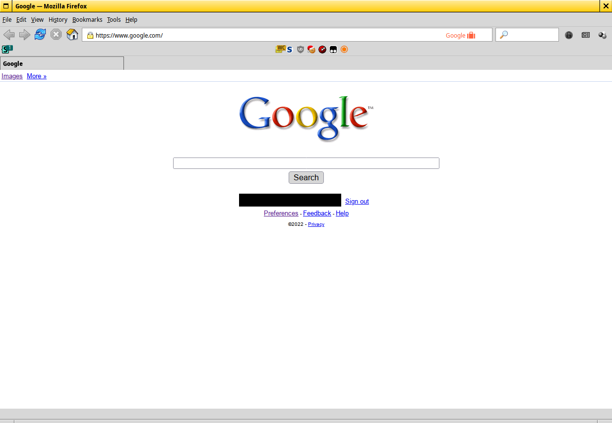
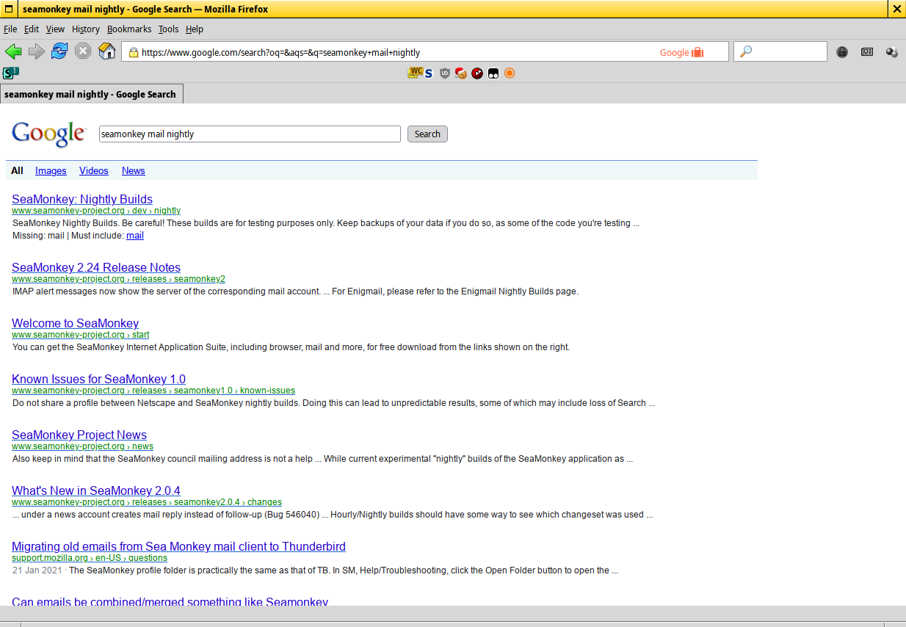

# Google 2009 theme
Theme Google (WAP version) to look like 2009 Google

# How to activate WAP version of Google?
Use the following user agent for Google: ```Mozilla/4.0 (compatible; MSIE 6.0; Windows CE; IEMobile 7.11)```

# How do I use this?
Apply the user agent for Google above and use a extension (like Stylus) to apply it. If you are on Firefox, you can use UserContent.css.

# Warning
Code is really messy.

# Screenshots


