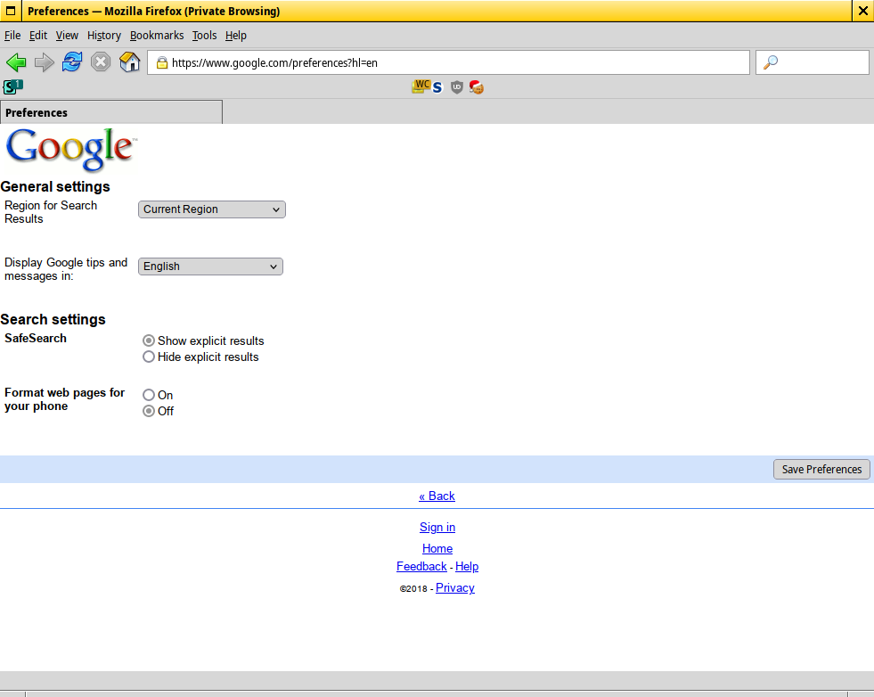

# Google 2009 theme
Theme Google (XHTML Mobile version) to look like 2009 Google

# How to activate XHTML Mobile version of Google?
Use the following user agent for Google: ```Mozilla/4.0 (compatible; MSIE 6.0; Windows CE; IEMobile 7.11)```

# How do I use this?
Apply the user agent for Google above and use a extension (like Stylus) to apply it. If you are on Firefox, you can use UserContent.css.

# Warning
Code is really messy.

# Screenshots
Homepage  
  
Search page  

Preferences page (far from done)  
  


# References used
https://oldgoogle.neocities.org/2009  
http://web.archive.org/web/20090901000000*/www.google.com

# NsFAQ
**Does this work with other languages?**  
Yes, however RTL languages seem to break a bit.  

**Why?**  
Why not?  
  
**The theme is broken. Please fix it.**  
Report the issue on GitHub issues.
